========
Utilizzo
========

Per poter utilizzare gli script e le funzioni all'interno del repositorio è necessario per prima cosa installare il pacchetto.
Il pacchetto è compatibile solo con versioni python non superiori alla 3.11.
Prima di tutto è necessario spostarsi nella cartella del repositorio.

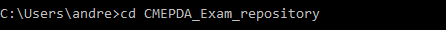

Successivamente si deve eseguire il comando qui sotto per installare la liberia, così da poter usare le funzioni e gli script.

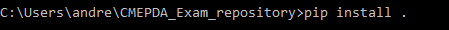

Una volta installato sarà possibile utilizzare sia le diverse funzioni per ottenere il dataset di articoli scientifici da HEP-INSPIRE,
che la funzioni e gli script per allenare i modelli e ottenere delle predizioni. 
In particolare utilizzando lo script utils.py è possibile scaricare il dataset e i modelli pre-allenati di default, che sono contenuti
nella Release del repositorio.

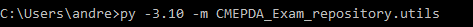

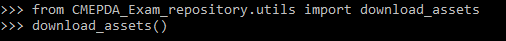

Dopo aver eseguito lo script da terminale o la funzione download_assets() da sessione o script python, il dataset sarà nella cartella
data; i modelli pre-allenati saranno nella cartella models.
Di seguito sono riportati esempi di utilizzo. Da terminale sarà possibile utilizzare gli script con parametri di default, in sessione
python sarà possibile modificare gli argomenti delle funzioni.

Python
======
Gli esempi riportati di seguito si riferiscono all'utilizzo delle funzioni all'interno di una sessione o di uno script python.

Dataset
-------
Le funzioni riportate di seguito sono funzioni necessarie per ottenere un dataset pronto per essere usato per l'allenamento
dei modelli di rete neurale. Nel repositorio è già presente un dataset completo da poter utilizzare nella cartella data se
è stata eseguita la funzione download_assets().
Per ottenere un dataset da fornire in input alle reti è necessario eseguire in ordine le seguenti funzioni da sessione python.

download_hep_ph_batches()
~~~~~~~~~~~~~~~~~~~~~~~~~
La funzione download_hep_ph_batches() permette di ottenere un dataset di articoli scaricati da HEP-INSPIRE.
Per modificare i valori degli argomenti della funzione è necessario utilizzare la funzione in una sessione python;
da terminale è possibile scaricare il dataset solamente con le impostazioni di default. Per ulteriori informazioni
sulla funzione consultare la sezione dataset.

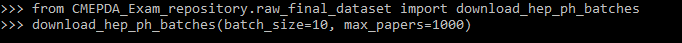

exploratory_data_analysis()
~~~~~~~~~~~~~~~~~~~~~~~~~~~
La funzione exploratory_data_analysis() permette di eseguire il clustering delle keywords del dataset scaricato con la
funzione download_hep_ph_batches(). Per ulteriori informazioni consultare la sezione EDA della documentazione.

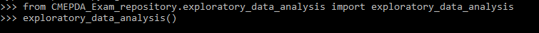

keywords_binarization()
~~~~~~~~~~~~~~~~~~~~~~~
La funzione keywords_binarization() permette di trasformare le keywords di ogni articolo in labels da poter essere utilizzate
per l'allenamento dei modelli di deep learning. Questa funzione deve essere utilizzata solamente dopo aver eseguito la funzione
exploratory_data_analysis(). Per ulteriori informazioni consultare la sezione EDA della documentazione.

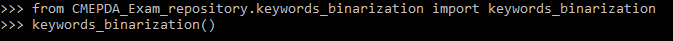

show_clusters_content()
~~~~~~~~~~~~~~~~~~~~~~~
La funzione show_clusters_content() permette di vedere le keywords ottenute dopo il clustering e le corrispondenti keywords che fanno parte del cluster.
Inoltre stampa tutte le keywords che sono state selezionate per essere utilizzate nell'allenamento della rete.

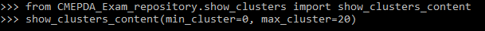

Modelli di rete neurale
-----------------------
Le funzioni riportate di seguito sono necessarie per l'allenamento delle reti nuerali sul nuovo dataset scaricato con le funzioni
della sezione precedente. Inoltre, sono riportate funzioni per ottenere le prestazioni e le predizioni sia dei modelli di default
che dei nuovi modelli allenati.

Training
~~~~~~~~
Per l'allenamento dei modelli sul nuovo dataset c'è una distinzione nell'utilizzo da terminale e da sessione python.
In python ci sono tre funzioni distinte per allenare uno dei tre modelli: train_model_Dense(), train_model_CNN() e train_model_LSTM().
Per ulteriori informazioni sugli argomenti da utilizzare consultare la sezione models della documentazione.

- train_model_Dense()

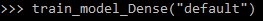

- train_model_CNN()

- train_model_LSTM()

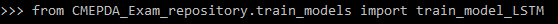

Predizioni dei modelli di default
~~~~~~~~~~~~~~~~~~~~~~~~~~~~~~~~~
In una sessione o in uno script python si deve utilizzare una delle 6 funzioni a seconda del tipo di modello e dello
scopo. Per ottenere esempi di predizioni e le prestazioni dei modelli di default le funzioni sono: Dense_model_prediction(), 
CNN_model_prediction() e LSTM_model_prediction(). Per ottenere le keywords su nuovi testi le funzioni da utilizzare sono:
Dense_model_new_prediction(), CNN_model_new_prediction() e LSTM_model_new_prediction(); a queste funzioni dovrà essere passata
una lista contenente i nuovi testi.

- Dense_model_prediction()

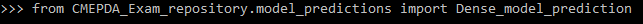

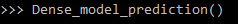

- CNN_model_prediction()

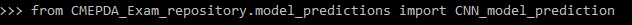

- LSTM_model_prediction()

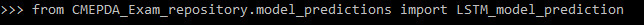

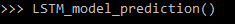

- Dense_model_new_prediction()

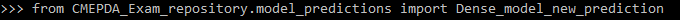

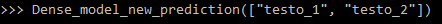

- CNN_model_new_prediction()

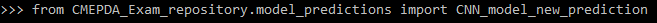

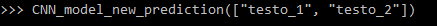

- LSTM_model_new_prediction()

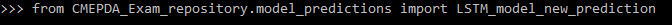

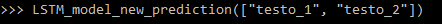

Predizioni dei nuovi modelli
~~~~~~~~~~~~~~~~~~~~~~~~~~~~
Allo stesso modo dei modelli di default, si devono utilizzare 6 funzioni per ottenere le predizioni e le prestazioni dei modelli allenati
con le funzioni della sezione Training. Per ottenere le predizioni sul dataset ottenuto dalle funzioni exploratory_data_analysis() e
keywords_binarization(), si devono usare queste funzioni a seconda del modello: trained_Dense_model_prediction(), trained_CNN_model_prediction(),
trained_LSTM_model_prediction().
Per ottenere le predizioni su nuovi testi sarà sufficiente passare come argomento una lista contenente i testi alle funzioni:
trained_Dense_model_new_prediction(), trained_CNN_model_new_prediction() e trained_LSTM_model_new_prediction().

- trained_Dense_model_prediction()

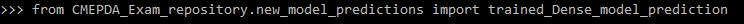

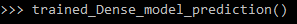

- trained_CNN_model_prediction()

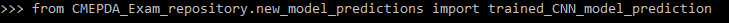

- trained_LSTM_model_prediction()

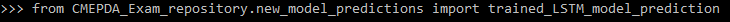

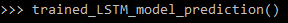

- trained_Dense_model_new_prediction()

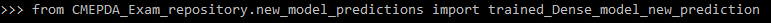

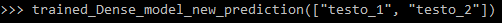

- trained_CNN_model_new_prediction()

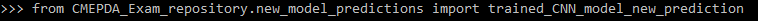

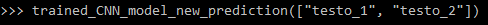

- trained_LSTM_model_new_prediction()

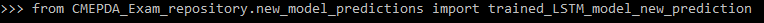

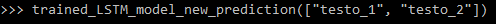

Terminale
=========
Per eseguire gli script da terminale è necessario eseguire i comandi riportati di seguito dopo aver installato il pacchetto del repositorio.

Dataset
-------
Per ottenere il dataset necessario ad allenare i modelli di rete neurale sono disponibili diversi script che possono essere eseguiti da terminale.

raw_final_dataset.py
~~~~~~~~~~~~~~~~~~~~
Questo script permette di ottenere un dataset di articoli scaricati da HEP-INSPIRE. Utilizzando lo script non è possibile cambiare il numero di articoli
scaricati (batch_size=50, max_papers=5000). Per ultriori informazioni consultare la sezione Dataset.

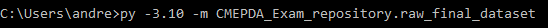

exploratory_data_analysis.py
~~~~~~~~~~~~~~~~~~~~~~~~~~~~
Questo script permette di eseguire il clustering delle keywords del dataset scaricato e generare un nuovo dataset con le nuove keywords.
Per ultriori informazioni consultare la sezione Exploratory Data Analysis.

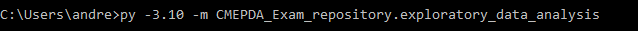

keywords_binarization.py
~~~~~~~~~~~~~~~~~~~~~~~~
Questo script permette di ottenere i label binari da utilizzare durante l'allenamento delle reti neurali. Questo script deve essere usato
dopo aver eseguito lo script exploratory_data_analysis.py. Per ulteriori informazioni consultare la sezione Exploratory Data Analysis.

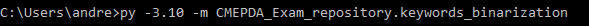

show_clusters.py
~~~~~~~~~~~~~~~~
Questo script permette di stampare le keywords ottenute dopo il clustering e di vedere quali keyword sono state inserite nel cluster
che corrisponde a quella keyword. Inoltre, vengono stampate le keywords selezionate per l'ellenamento dei modelli.

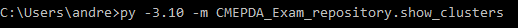

Modelli di rete neurale
-----------------------
In questa sezione sono illustrati esempi di come utilizzare gli script da terminale per allenare i modelli su nuovi dataset, ottenere le predizioni e
le prestazioni dei modelli sul dataset di default, oppure utilizzare i modelli di default o i nuovi modelli per ottenere le keywords su nuovi testi.
Per utilizzare questi script è necessario aver installato una versione di python non superiore alla 3.11

train_models.py
~~~~~~~~~~~~~~~
Questo script permette di allenare modelli di rete neurale sul nuovo dataset ottenuto utilizzando gli script della sezione Dataset o sul dataset di default.
Per utilizzare questo script è necessario inserire, dopo il nome dello script, il tipo di modello che si vuole allenare (Dense, CNN o LSTM)
seguito da new se si vuole utilizzare il nuovo dataset oppure dafault se si vuole utilizzare il dataset di default.

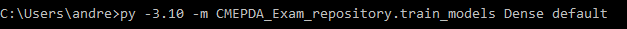

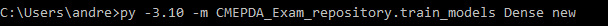

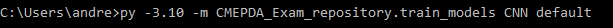

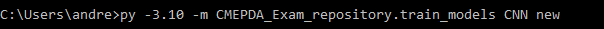

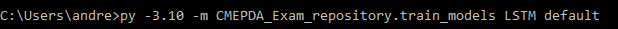

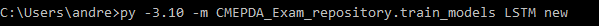

model_predictions.py
~~~~~~~~~~~~~~~~~~~~
Questo script permette di utilizzare i modelli pre-allenati con il dataset di default. Dopo il nome dello script deve essere indicato il tipo di modello
che si intende utilizzare. In questo modo saranno stampati la struttura della rete, alcuni esempi di predizioni confrontate con le originali e
i grafici che riportano i valori delle metriche al variare della soglia decisionale.
Se si intende utilizzare uno di questi modelli per ottenere le keywords di nuovi articoli, sarà sufficiente inserire i testi tra virgolette dopo il tipo
di modello.

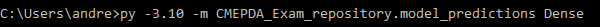

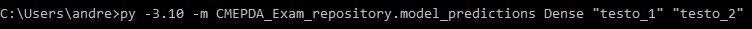

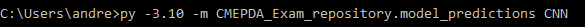

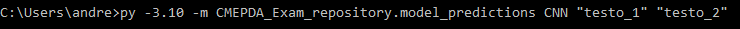

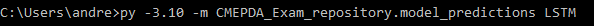

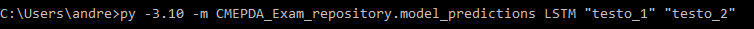

new_model_predictions.py
~~~~~~~~~~~~~~~~~~~~~~~~
Questo script permette di utilizzare i modelli allenati con il dataset ottenuto dagli script exploratory_data_analysis.py e keywords_binarization.py.
Dopo il nome dello script deve essere indicato il tipo di modello che si intende utilizzare. In questo modo saranno stampati la struttura della rete,
alcuni esempi di predizioni confrontate con le originali e i grafici che riportano i valori delle metriche al variare della soglia decisionale.
Se si intende utilizzare uno di questi modelli per ottenere le keywords di nuovi articoli, sarà sufficiente inserire i testi tra virgolette dopo il tipo
di modello.

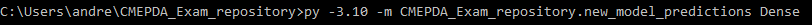

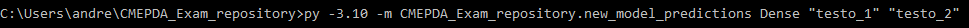

